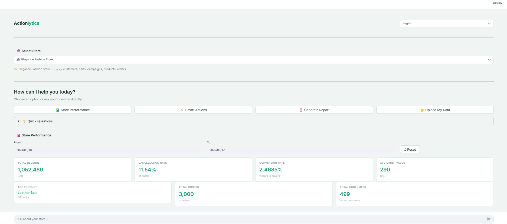
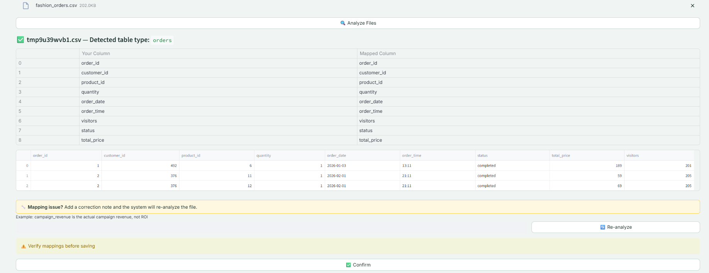
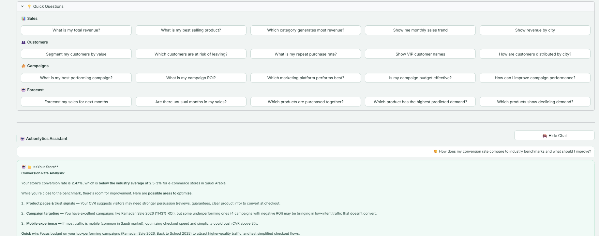
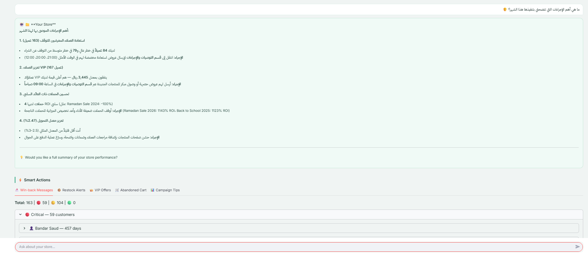
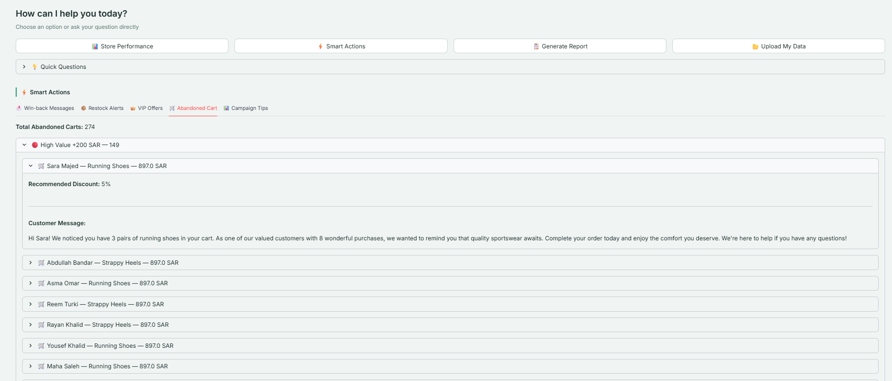
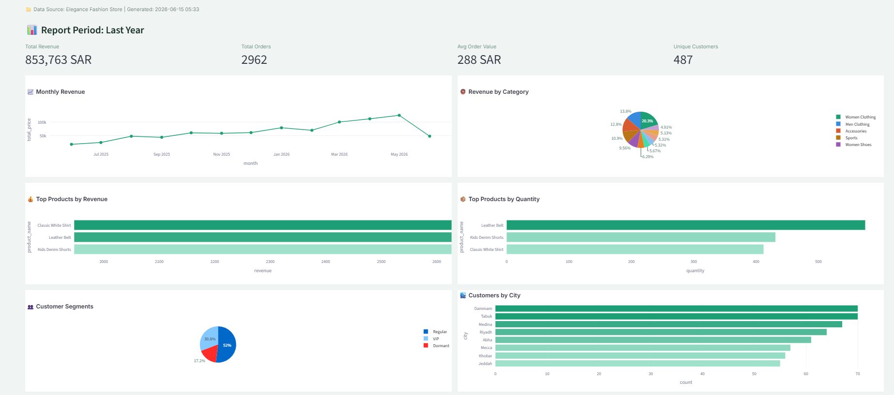
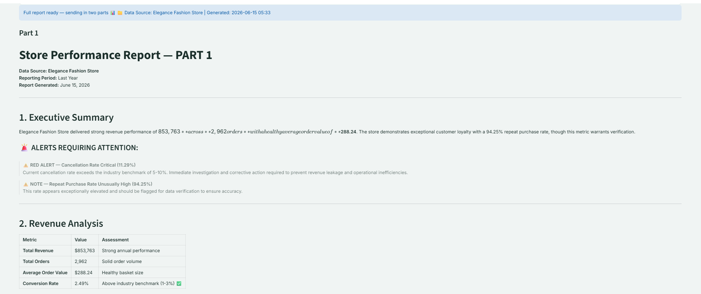
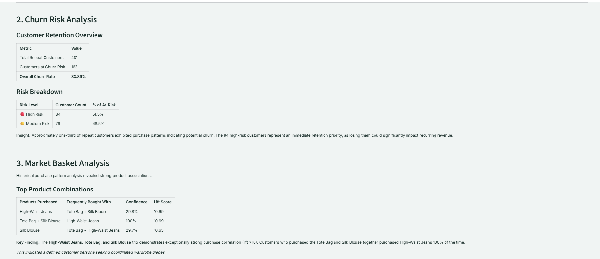
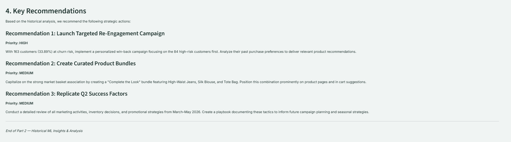

# Actionlytics — AI Copilot for E-Commerce

**Actionlytics** is an Applied AI Copilot for small and medium-sized e-commerce businesses. It helps store owners understand performance, detect risks, compare results against benchmarks, generate reports, and convert insights into actionable business recommendations.

The project combines **Analytics + Machine Learning + RAG + LLM Chatbot + Smart Actions + Dynamic Reports**.

---

## 1. Project Goal

Most dashboards show numbers, but many store owners still struggle to answer:

- What happened?
- Why did it happen?
- What might happen next?
- What should I do about it?

Actionlytics was built to bridge the gap between **business insights** and **business actions**.

Instead of only displaying KPIs, the system uses analytics, machine learning, retrieval-augmented generation, and LLMs to provide explainable insights and practical recommendations.

---

## 2. System Architecture

```text
User / Store Owner
        ↓
Streamlit App
        ↓
Data Layer
(SQLite + Uploaded CSV/Excel + Store Registry)
        ↓
Analytics Layer
(KPIs, revenue, conversion, cancellation, repeat purchase)
        ↓
Machine Learning Layer
(Forecasting, Segmentation, Churn, Anomaly Detection, Market Basket)
        ↓
RAG Layer
(Benchmarks + Best Practices Retrieval)
        ↓
Context Engineering
(Structured summaries + JSON context)
        ↓
Claude LLM
(Chatbot Answers + Reports + Action Messages)
        ↓
Action Engine / Report Engine
(Business Recommendations + Dynamic Reports)
```
For a detailed architecture breakdown, see [ARCHITECTURE.md](ARCHITECTURE.md).
---

## 📸 Screenshots

### Home Interface

Multi-store AI copilot interface with KPI overview, chatbot access, report generation, and smart actions.



---

### Data Upload & AI-Assisted Mapping

CSV and Excel upload workflow with automatic table detection, AI-assisted column mapping, preview, correction notes, and validation before saving.



---

### AI Chatbot — Industry Benchmark Analysis

Compare store performance against industry benchmarks using analytics, RAG, and LLM-powered reasoning.



---

### AI Chatbot — Arabic Business Recommendations

Bilingual support with actionable business recommendations and insights in Arabic.



---

### Smart Actions Engine

Human-in-the-loop business recommendations for customer retention, re-engagement campaigns, abandoned carts, VIP offers, and operational improvements.



---

### Interactive Business Dashboard

Automatically generated KPI dashboard with revenue trends, customer segmentation, category performance, and top-selling products.



---

### Executive Summary Report

Executive-level business analysis highlighting key metrics, alerts, opportunities, and overall store performance.



---

### Machine Learning Insights

Advanced analytics including anomaly detection, churn risk analysis, market basket analysis, and predictive business intelligence.



---

### Strategic Recommendations

Data-driven recommendations generated from analytics, machine learning models, and business rules to support decision-making.




## 3. Key Features

### Store Analytics

The analytics layer calculates core business KPIs:

- Total revenue
- Average order value
- Cancellation rate
- Conversion rate
- Repeat purchase rate
- Revenue by category
- Best-selling products
- Campaign ROI
- Profitability when cost data is available

Numerical calculations are handled in Python, not by the LLM, to keep results deterministic and reproducible.

---

### Machine Learning Layer

#### Sales Forecasting

The forecasting component compares multiple models and selects the best performer:

- Linear Regression
- Ridge
- Lasso
- Random Forest

Selection is based on evaluation metrics (MAE, RMSE, MAPE) using time-based backtesting. The best model is used for the final forecast. Additional features include:

- Forecast reliability estimate
- Seasonal features: `month_of_year`, `quarter`, `is_q4`

#### Customer Segmentation

Customer segmentation uses KMeans with StandardScaler and behavioral features:

- total_spent
- order_count
- avg_order_value
- days_since_last

Segments are mapped into business-friendly labels:

- VIP
- Regular
- Dormant

#### Churn Detection

Churn is behavior-based rather than supervised classification. It uses:

- average days between purchases
- days since last order
- churn threshold = average purchase gap × 2

#### Market Basket Analysis

The system uses Apriori and association rules to detect products commonly purchased together using support, confidence, and lift.

#### Anomaly Detection

Isolation Forest is used to detect unusual monthly revenue spikes or drops.

---

### RAG Layer

The RAG layer retrieves benchmark and best-practice knowledge from `knowledge_base.md`.

It uses:

- Recursive text chunking
- HuggingFace multilingual embeddings
- FAISS vector search
- Similarity threshold filtering
- Metadata-enriched benchmark context

The knowledge base includes Saudi and global e-commerce benchmarks for conversion, cancellation, churn, repeat purchase, campaign ROI, cart abandonment, and electronics-specific metrics.

Retrieval evaluation on the internal test set achieved approximately 90% accuracy.

A known edge case exists when some Arabic queries combine multiple benchmark categories in a single question, which may retrieve a closely related category instead of the exact intended benchmark.

---

### Chatbot Layer

The chatbot is a grounded AI copilot, not a fully autonomous agent.

It uses:

- Analytics summaries
- ML outputs
- Conditional RAG context
- Conversation history limit
- Programmatic data-source prefix
- VIP names injected only when specifically requested
- Smart Action redirection for operational requests

The chatbot explains insights and guides users, but it does not automatically execute business actions.

---

### Smart Action Engine

The Action Engine converts insights into structured business recommendations.

It supports:

- Win-back messages for churn-risk customers
- Restock alerts
- VIP offers
- Abandoned cart reminders
- Campaign recommendations
- Best send time analysis

Each action includes:

- Business category
- Problem
- Evidence
- Recommendation
- Expected outcome
- Impact
- Urgency
- Priority score
- Customer or manager message

Actions are sorted by priority using an impact × urgency matrix. This makes the layer closer to **Prescriptive Analytics / Decision Support**, not just message generation.

---

### Report Engine

The Report Engine generates dynamic business reports.

Python is responsible for:

- KPI calculation
- ML insight extraction
- filtering by period
- missing data detection
- report limitations
- generated timestamp
- data source header

Claude is responsible for:

- business narrative
- explanation
- summary
- recommendations

Reports are intentionally historical only. Forecasting is kept separate to avoid mixing past analysis with future predictions.

---

### Data Upload and Multi-Store Support

Users can upload CSV or Excel files. The system supports:

- automatic table type detection
- LLM-assisted column mapping
- Arabic and English column names
- manual correction notes
- data cleaning
- required-column validation
- multi-file processing
- saved stores and session-only analysis

Supported tables:

- orders
- customers
- products
- campaigns
- carts

## 🌐 Bilingual Support

Actionlytics supports both English and Arabic across the platform, including:

- AI Chatbot conversations
- Analytics explanations
- Smart Action recommendations
- Generated reports
- Data upload workflows

Language is detected automatically, allowing users to interact naturally in either English or Arabic.
---

## 4. Core Design Philosophy

Actionlytics follows a hybrid AI architecture:

```text
Python computes.
ML predicts.
RAG retrieves.
Claude explains.
Action Engine recommends.
```

This design reduces hallucination risk, keeps calculations deterministic, and makes the system easier to test and explain.

---

## 5. Technical Decisions

### Why not send raw data directly to Claude?

Raw transactional data increases token cost, latency, and hallucination risk. Actionlytics first summarizes the data using analytics and ML pipelines, then sends structured context to the LLM.

### Why JSON / structured context?

Structured context reduces ambiguity and makes each value explicitly tied to a field name. It is more reliable and token-efficient than raw DataFrames or long natural language summaries.

### Why not a full AI agent?

The project prioritizes reliability and control. The chatbot does not freely choose tools or execute actions. Business logic remains deterministic and human-reviewed.

### Why SQLite?

SQLite is simple, portable, and suitable for a portfolio/demo project. For production, PostgreSQL would be more appropriate.

### Why FAISS?

FAISS is lightweight and works locally for semantic search over a small benchmark knowledge base. Managed vector databases can be considered later for production scale.

---

## 6. Hallucination Mitigation

Actionlytics follows a grounded AI architecture designed to reduce hallucination risk.

The system minimizes hallucinations through:

- Analytics calculated directly in Python
- Structured context instead of raw datasets
- Conditional RAG retrieval
- Similarity threshold filtering
- Smart Action routing
- Deterministic KPI calculations
- Business logic executed outside the LLM

This architecture ensures that calculations remain reproducible while the LLM focuses on explanation, summarization, and recommendation generation.

---

## 7. Model Evaluation and MLOps Awareness

The project includes:

- Time-based backtesting
- MAE, RMSE, MAPE
- Forecast reliability estimate
- Product demand reliability notes
- Model registry file for tracking forecast and demand runs
- Data validation before saving uploaded files

Future MLOps improvements include:

- experiment tracking
- model monitoring
- scheduled retraining
- drift detection
- database-backed model registry
- deployment pipeline

---

## 8. Limitations

See [`LIMITATIONS.md`](LIMITATIONS.md) for a detailed discussion of current limitations and future improvements.

---

## 9. Future Roadmap

Planned improvements:

- PostgreSQL migration
- authentication and user accounts
- stronger upload validation
- metadata-aware RAG retrieval
- larger retrieval evaluation set
- action approval workflow
- action tracking
- margin-aware discount recommendations
- model monitoring
- richer report templates
- Docker deployment
- live demo deployment

---

## 10. Data Contract

Actionlytics expects the following tables. Each can be uploaded as a CSV or Excel file — column mapping is handled automatically via Claude.

| Table | Key Columns |
|-------|-------------|
| `orders` | order_id, customer_id, product_id, quantity, order_date, status, total_price |
| `customers` | customer_id, customer_name, city, gender, registration_date |
| `products` | product_id, product_name, category, cost_price, selling_price, stock_quantity |
| `campaigns` | campaign_id, campaign_name, platform, budget, clicks, conversions, campaign_revenue |
| `carts` | cart_id, customer_id, product_id, quantity, cart_date, status |

Arabic and English column names are both supported. The system will map uploaded columns to this schema automatically and flag missing required fields before saving.

---

## 11. Tech Stack

- Python
- Streamlit
- Pandas
- NumPy
- SQLite
- scikit-learn
- mlxtend
- LangChain
- FAISS
- HuggingFace Embeddings
- Anthropic Claude
- Plotly

---

## 12. AI Stack

| Component    | Model                         | Purpose                       |
|--------------|-------------------------------|-------------------------------|
| Chatbot      | claude-sonnet-4-5             | Natural language Q&A          |
| Reports      | claude-opus-4-5               | Full business reports         |
| Actions      | claude-haiku-4-5-20251001     | Customer messages (on-demand) |
| Best Send Time | claude-haiku-4-5-20251001   | Optimal send-time analysis    |
| File Mapping | claude-haiku-4-5-20251001     | Column mapping                |
| RAG          | FAISS + sentence-transformers | Industry benchmarks           |

---

## Cost Optimization

The system is intentionally designed to reduce unnecessary LLM usage.

Optimization techniques include:

- Conditional RAG retrieval
- Lazy-loaded Smart Actions
- Analytics-first architecture
- Structured context generation
- On-demand customer message generation
- Local FAISS retrieval with zero API cost

This approach significantly reduces token consumption while maintaining response quality.

---

## 13. Demo Store

The app includes a pre-loaded electronics demo store. The exact dataset size may vary depending on the generated or uploaded demo data, but typically includes:

- ~2,000 orders
- ~400 customers
- ~20 products
- ~14 campaigns

> Note: These counts reflect the default generated dataset. Actual numbers depend on the data present in `store.db`.

---

## 14. How to Run

1. Clone the repository:

```bash
git clone <your-repo-url>
cd actionlytics
```

2. Create and activate a virtual environment:

```bash
python -m venv venv
source venv/bin/activate
```

On Windows:

```bash
venv\Scripts\activate
```

3. Install dependencies:

```bash
pip install -r requirements.txt
```

4. Add your API key in `.env`:

```env
ANTHROPIC_API_KEY=your_api_key_here
```

A `.env.example` file is included in the repository as a reference template. Copy it to `.env` and add your key.

> **⚠️ GitHub Safety Note:** Never commit `.env` files, API keys, local SQLite databases containing real customer data, or any uploaded user files to version control. All of these are listed in `.gitignore`.

5. Run the app:

```bash
cd data
streamlit run app.py
```

---

## 15. Suggested Demo Flow

1. Open dashboard
2. Review store KPIs
3. Ask the chatbot about revenue, conversion, churn, or benchmarks
4. Review ML insights
5. Open Smart Actions
6. Generate a dynamic report
7. Upload sample CSV/Excel data
8. Compare uploaded data against the demo store

---

## 16. Portfolio Value

This project demonstrates:

- end-to-end AI system design
- applied ML fundamentals
- RAG implementation
- prompt and context engineering
- business analytics
- data validation
- human-in-the-loop AI design
- reliability-focused LLM integration
- practical product thinking

---

## Live Demo

A live hosted version of Actionlytics is available upon request.

The hosted demo is maintained privately to manage infrastructure resources, API costs, and ongoing maintenance.

---

## Author

👩‍💻 **Umniyat Hausawi**
AI Engineer | Machine Learning, Deep Learning & NLP Projects
